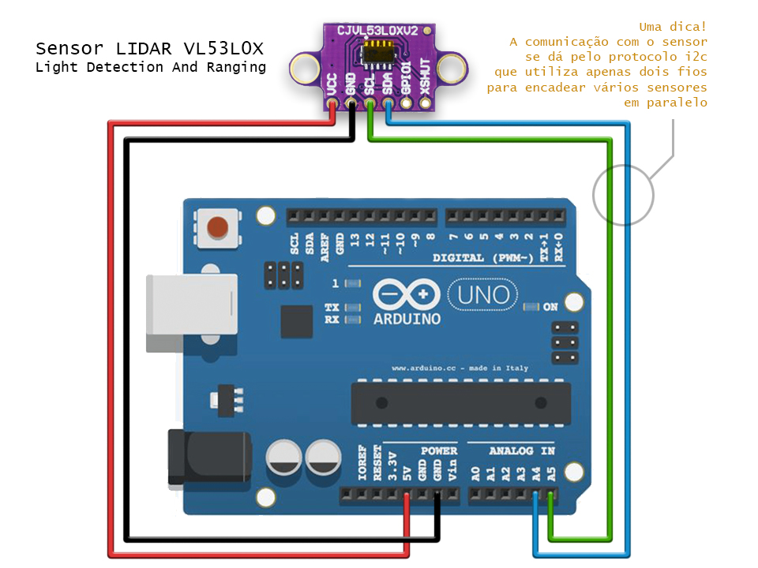
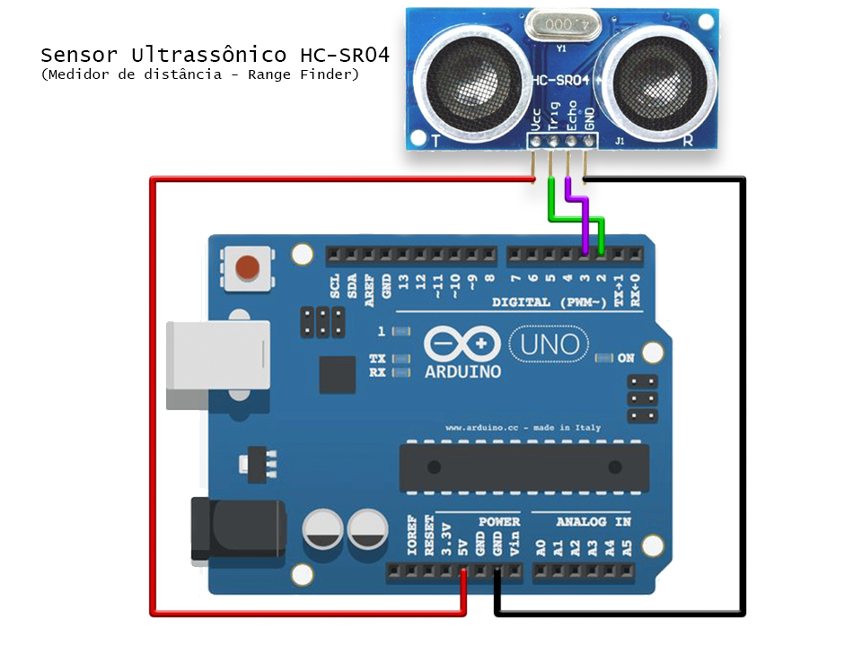

# Arduino_OSC_SLIP
Esse projeto permite enviar mensagens OSC (Open Sound Control) a partir de um Arduino via SLIP (Serial Line Internet Protocol).

Esse projeto é composto de vários exemplos, com múltiplos sensores e diferentes características. Os exemplos estão divididos em pastas.

## OSC_LIDAR_US
Nessa pasta temos um exemplo que utiliza um Arduino e um sensor de distância.
O código permite escolher entre dois tipos: LIDAR (Light Detection And Ranging) ou Ultrassônico.
O Arduino lê o valor detectado pelo sensor e envia esse valor dinâmico para controlar objetos no PD (Pure Data, Purr Data ou PD Extended).

A pasta OSC_LIDAR_US contém dois diretórios:
- **Arduino_OSC_PD:** Projeto a ser compilado no Visual Studio Code, utilizando a plataforma colaborativa PlatformIO IDE (aqui, configurada para resolver automaticamente as dePendências de bibliotecas necessárias neste projeto). 
- **Patch_PD:** Arquivo do PD que recebe mensagens OSC e controla o um instrumento cujo pitch das notas MIDI são calculadas a partir dos valores medidos pelo sensor de distância.

Abaixo vemos o diagrama de conexão do sensor LIDAR VL53L0X com um arduino UNO:

Abaixo vemos o diagrama de conexão do sensor ultrassônico HC-SR04 com um arduino UNO:

