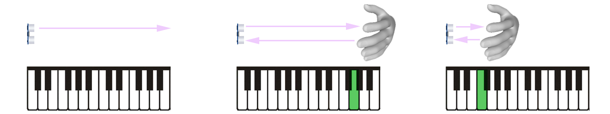

# Arduino_OSC_SLIP

<pre>Este experimento faz parte do Projeto de Extensão "Repositório de Código do LAC".
Um projeto que visa disponibilizar código e documentação de referência para os desenvolvimentos
no Laboratório de Artes Computacionais da Escola de Belas Artes da UFMG,
estendendo o acesso a esse material à comunidade geral de software e hardware livres.</pre>

Este projeto permite enviar mensagens OSC (Open Sound Control) a partir de um Arduino via SLIP (Serial Line Internet Protocol).

## OSC_LIDAR_US
Nessa pasta temos um exemplo que utiliza um Arduino e um sensor de distância.
O código permite escolher entre dois tipos: LIDAR (Light Detection And Ranging) ou Ultrassônico.
O Arduino lê o valor detectado pelo sensor e envia esse valor dinâmico para controlar objetos no PD (Pure Data, Purr Data ou PD Extended).
O patch incluso do PD utiliza um instrumento virtual baseado em arquivo .sf2 (SoundFont), e gera sons a partir das notas acionadas por meio dessa interface.

A pasta OSC_LIDAR_US contém dois diretórios:
- **Arduino_OSC_PD:** Projeto a ser compilado no Visual Studio Code, utilizando a plataforma colaborativa PlatformIO IDE (aqui, configurada para resolver automaticamente as dePendências de bibliotecas necessárias neste projeto). 
- **Patch_PD:** Arquivo do PD que recebe mensagens OSC e controla um instrumento virtual cujo pitch das notas MIDI são calculadas a partir dos valores medidos pelo sensor de distância.

Abaixo vemos o diagrama de conexão do sensor LIDAR VL53L0X com um arduino UNO:

Abaixo vemos o diagrama de conexão do sensor ultrassônico HC-SR04 com um arduino UNO:

